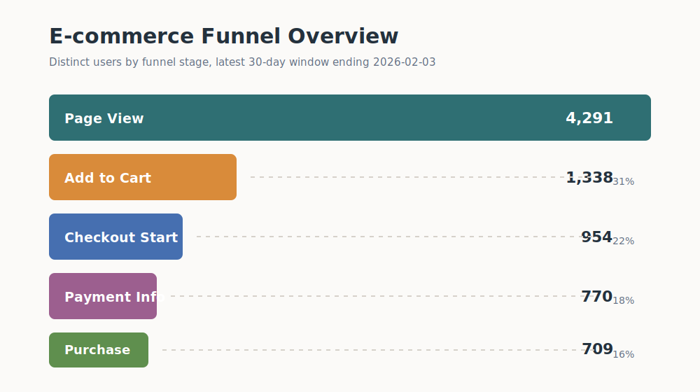
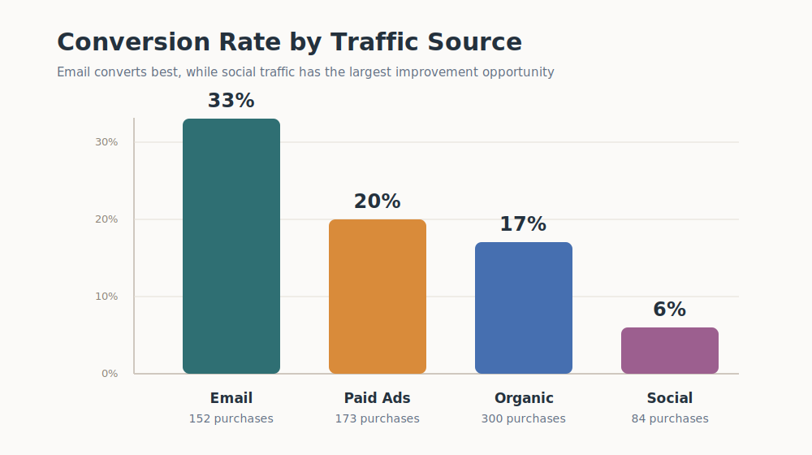
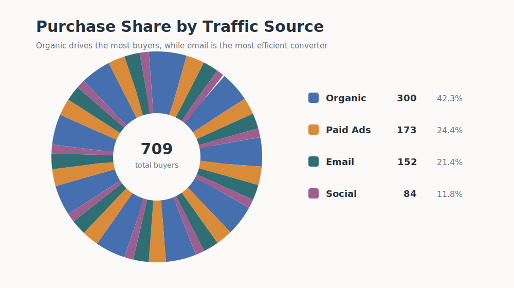
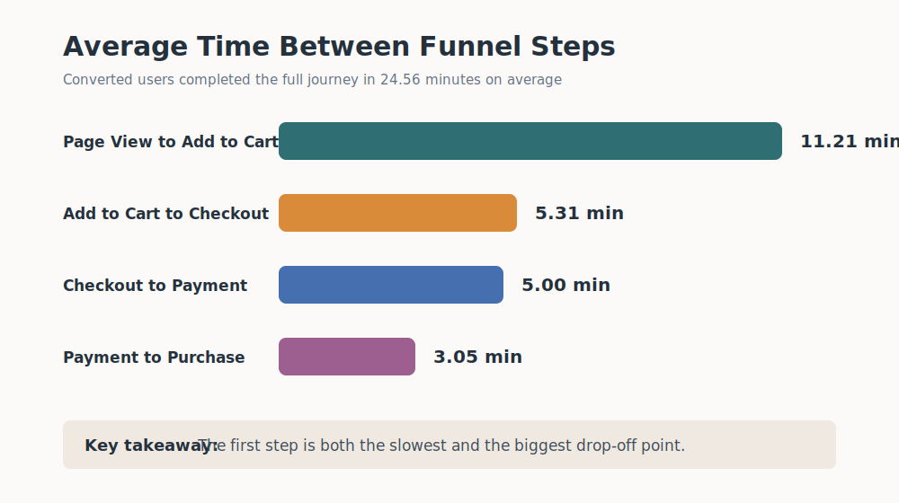

# E-commerce Funnel Analysis Using SQL

## Project Overview

This project analyzes user behavior across an e-commerce conversion funnel using event-level data. The goal was to identify where users drop off, compare conversion performance by traffic source, measure the time taken to convert, and estimate purchase revenue metrics.

The analysis was performed using SQL on a `user_events` dataset containing user-level events such as page views, add-to-cart actions, checkout starts, payment information submissions, and purchases.

## Objective

The main objective of this project was to answer the following business questions:

- How many users reached each stage of the funnel?
- What are the conversion rates between funnel stages?
- Which traffic sources drive the highest-quality users?
- How long does it take for converted users to complete the purchase journey?
- What is the overall revenue and average revenue per buyer?

## Dataset

The dataset contains user activity events with the following fields:

| Column | Description |
| --- | --- |
| `event_id` | Unique identifier for each event |
| `user_id` | Unique identifier for each user |
| `event_type` | Type of user action performed |
| `event_date` | Timestamp of the event |
| `product_id` | Product associated with the event |
| `amount` | Purchase amount, available for purchase events |
| `traffic_source` | Channel from which the user arrived |

The analysis focuses on the latest 30-day window ending on `2026-02-03`.

## Funnel Stages

The funnel was defined using the following user actions:

1. `page_view`
2. `add_to_cart`
3. `checkout_start`
4. `payment_info`
5. `purchase`

## Visual Summary

## Key Results

### Overall Funnel Count

| Funnel Stage | Users |
| --- | ---: |
| Page View | 4,291 |
| Add to Cart | 1,338 |
| Checkout Start | 954 |
| Payment Info | 770 |
| Purchase | 709 |

### Overall Conversion Rates

| Metric | Conversion Rate |
| --- | ---: |
| Page View to Add to Cart | 31% |
| Add to Cart to Checkout | 71% |
| Checkout to Payment Info | 80% |
| Payment Info to Purchase | 92% |
| Overall Conversion Rate | 16% |

The largest drop-off occurs between `page_view` and `add_to_cart`, where only 31% of users who viewed a product added it to their cart.

## Traffic Source Analysis

| Traffic Source | Views | Cart | Checkout | Payment | Purchases | Overall Conversion |
| --- | ---: | ---: | ---: | ---: | ---: | ---: |
| Organic | 1,757 | 578 | 415 | 334 | 300 | 17% |
| Paid Ads | 824 | 306 | 224 | 183 | 173 | 20% |
| Email | 449 | 283 | 197 | 162 | 152 | 33% |
| Social | 1,261 | 171 | 118 | 91 | 84 | 6% |

### Traffic Source Insights

- **Email had the highest overall conversion rate at 33%**, despite having the lowest number of views.
- **Organic traffic generated the highest number of purchases**, contributing 300 buyers.
- **Paid ads performed efficiently**, with a 20% overall conversion rate and strong progression through later funnel stages.
- **Social traffic had the weakest performance**, converting only 6% of viewers into buyers.

## Time-to-Conversion Analysis

For users who completed a purchase, the average time taken between funnel stages was:

| Funnel Step | Average Time |
| --- | ---: |
| Page View to Add to Cart | 11.21 minutes |
| Add to Cart to Checkout | 5.31 minutes |
| Checkout to Payment Info | 5.00 minutes |
| Payment Info to Purchase | 3.05 minutes |
| Page View to Purchase | 24.56 minutes |

Converted users completed the full journey in approximately **24.56 minutes on average**. The longest delay occurred between `page_view` and `add_to_cart`, which aligns with the largest conversion drop-off in the funnel.

## Revenue Analysis

| Metric | Value |
| --- | ---: |
| Total Visitors | 4,291 |
| Total Buyers | 709 |
| Total Revenue | 76,191.82 |
| Net Purchase Rate | 16% |
| Average Revenue per Buyer | 107.46 |

The funnel generated **76,191.82** in total revenue from **709 buyers**, with an average purchase value of **107.46** per buyer.

## Business Insights

- The top-of-funnel stage needs the most improvement because the biggest user drop-off happens before users add products to their cart.
- Email traffic is the most valuable channel by conversion rate and should be prioritized for retention campaigns, personalized offers, and repeat purchase strategies.
- Organic traffic brings the highest purchase volume, making SEO and product discovery important growth levers.
- Social traffic attracts a large number of visitors but has poor conversion quality, suggesting that targeting, landing pages, or audience intent may need improvement.
- Once users reach the payment stage, the funnel performs strongly, with a 92% payment-to-purchase conversion rate.

## Recommendations

- Improve product pages with clearer pricing, stronger product descriptions, reviews, and more visible add-to-cart calls to action.
- Investigate why social traffic has low purchase intent and test more targeted campaigns or dedicated landing pages.
- Scale email campaigns because they show the strongest conversion efficiency.
- Continue investing in organic acquisition because it contributes the highest purchase volume.
- Reduce friction in the early funnel by testing product recommendations, limited-time offers, and cart incentives.

## SQL Concepts Used

- Common Table Expressions
- Conditional aggregation using `CASE WHEN`
- `COUNT(DISTINCT ...)`
- Funnel conversion rate calculations
- Traffic source segmentation
- Timestamp difference calculations
- Revenue aggregation

## Conclusion

This project demonstrates how SQL can be used to analyze an e-commerce funnel, identify conversion bottlenecks, evaluate marketing channel performance, and generate actionable business recommendations. The analysis shows that while the checkout and payment stages are performing well, the largest opportunity lies in improving the transition from product views to add-to-cart actions.
